# AEROPULSE PlantUML Activity Diagram Verification

**Verified branch:** `main-martyn`  
**Verification date:** September 23, 2026

## Mobile Application

### 1. Sign in

Corrected the flow to apply TOTP only to Customer accounts that require it, keep Technician sign-in password-only, and consolidate authentication outcomes into two exit nodes.

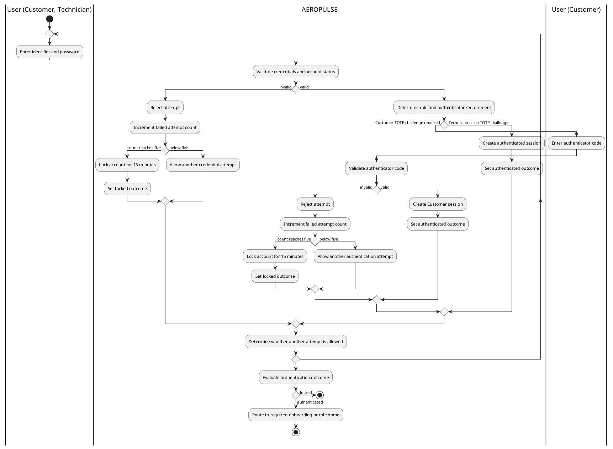
```plantuml
@startuml
|User (Customer, Technician)|
start
repeat
  :Enter identifier and password;
  |AEROPULSE|
  :Validate credentials and account status;
  if () then (invalid)
    :Reject attempt;
    :Increment failed attempt count;
    if () then (count reaches five)
      :Lock account for 15 minutes;
      :Set locked outcome;
    else (below five)
      :Allow another credential attempt;
    endif
  else (valid)
    :Determine role and authenticator requirement;
    if () then (Customer TOTP challenge required)
      |User (Customer)|
      :Enter authenticator code;
      |AEROPULSE|
      :Validate authenticator code;
      if () then (invalid)
        :Reject attempt;
        :Increment failed attempt count;
        if () then (count reaches five)
          :Lock account for 15 minutes;
          :Set locked outcome;
        else (below five)
          :Allow another authentication attempt;
        endif
      else (valid)
        :Create Customer session;
        :Set authenticated outcome;
      endif
    else (Technician or no TOTP challenge)
      :Create authenticated session;
      :Set authenticated outcome;
    endif
  endif
  :Determine whether another attempt is allowed;
repeat while ()
:Evaluate authentication outcome;
if () then (authenticated)
  :Route to required onboarding or role home;
  stop
else (locked)
  stop
endif
@enduml
```

### 2. Register

Corrected the flow to create an authenticated Customer session and route directly to Customer onboarding for authenticator setup instead of routing the new account back to Sign in.

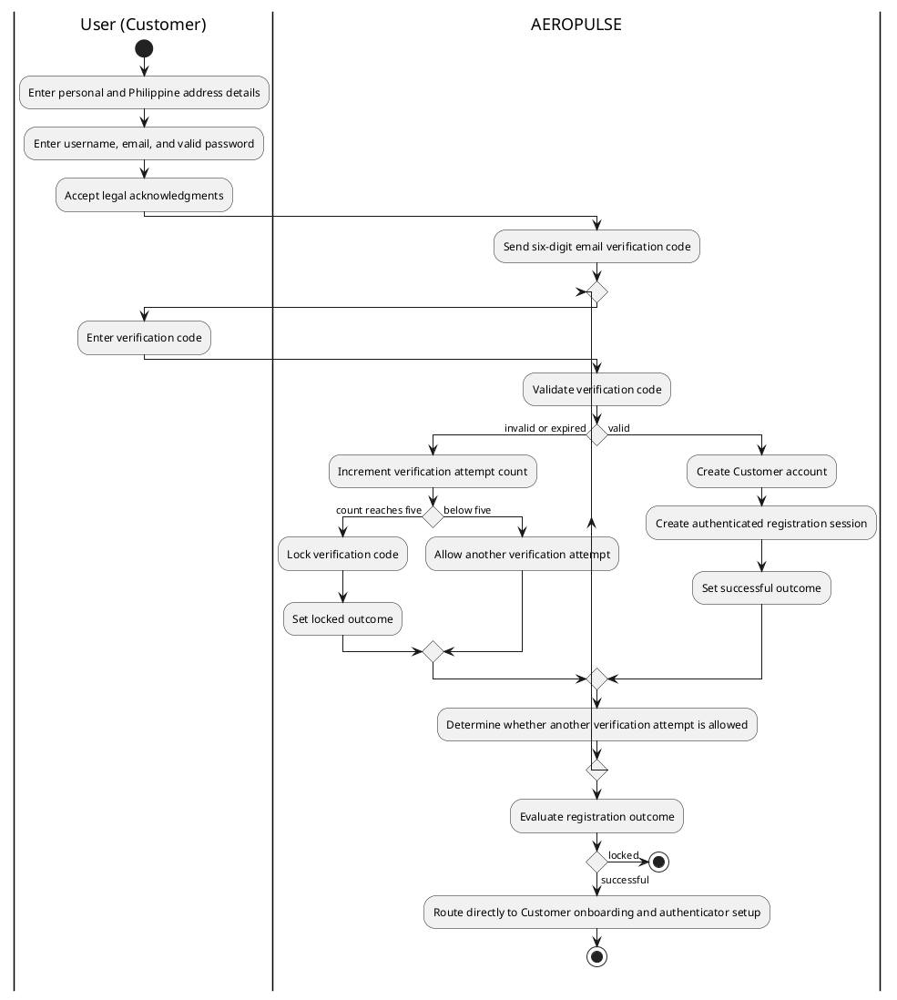
```plantuml
@startuml
|User (Customer)|
start
:Enter personal and Philippine address details;
:Enter username, email, and valid password;
:Accept legal acknowledgments;
|AEROPULSE|
:Send six-digit email verification code;
repeat
  |User (Customer)|
  :Enter verification code;
  |AEROPULSE|
  :Validate verification code;
  if () then (invalid or expired)
    :Increment verification attempt count;
    if () then (count reaches five)
      :Lock verification code;
      :Set locked outcome;
    else (below five)
      :Allow another verification attempt;
    endif
  else (valid)
    :Create Customer account;
    :Create authenticated registration session;
    :Set successful outcome;
  endif
  :Determine whether another verification attempt is allowed;
repeat while ()
:Evaluate registration outcome;
if () then (successful)
  :Route directly to Customer onboarding and authenticator setup;
  stop
else (locked)
  stop
endif
@enduml
```

### 3. Recover account

Corrected the flow to provide email password reset to Customer and Technician, restrict single-use authenticator recovery codes to Customer, and remove the unsupported shared lockout behavior for recovery codes.

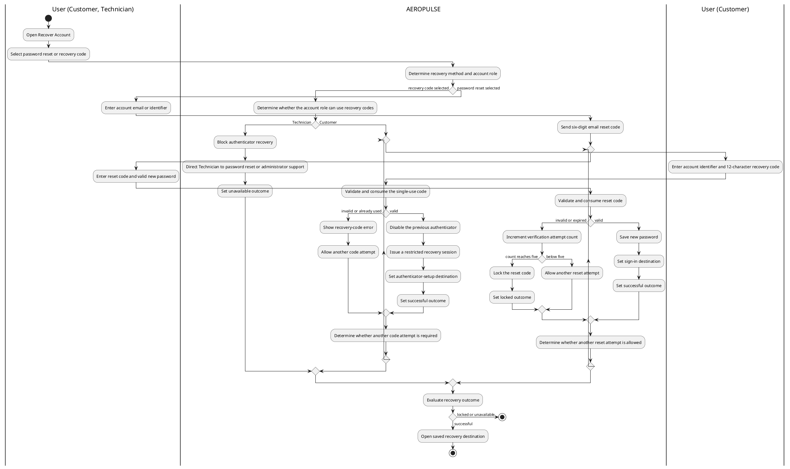
```plantuml
@startuml
|User (Customer, Technician)|
start
:Open Recover Account;
:Select password reset or recovery code;
|AEROPULSE|
:Determine recovery method and account role;
if () then (recovery code selected)
  :Determine whether the account role can use recovery codes;
  if () then (Technician)
    :Block authenticator recovery;
    :Direct Technician to password reset or administrator support;
    :Set unavailable outcome;
  else (Customer)
    repeat
      |User (Customer)|
      :Enter account identifier and 12-character recovery code;
      |AEROPULSE|
      :Validate and consume the single-use code;
      if () then (invalid or already used)
        :Show recovery-code error;
        :Allow another code attempt;
      else (valid)
        :Disable the previous authenticator;
        :Issue a restricted recovery session;
        :Set authenticator-setup destination;
        :Set successful outcome;
      endif
      :Determine whether another code attempt is required;
    repeat while ()
  endif
else (password reset selected)
  |User (Customer, Technician)|
  :Enter account email or identifier;
  |AEROPULSE|
  :Send six-digit email reset code;
  repeat
    |User (Customer, Technician)|
    :Enter reset code and valid new password;
    |AEROPULSE|
    :Validate and consume reset code;
    if () then (invalid or expired)
      :Increment verification attempt count;
      if () then (count reaches five)
        :Lock the reset code;
        :Set locked outcome;
      else (below five)
        :Allow another reset attempt;
      endif
    else (valid)
      :Save new password;
      :Set sign-in destination;
      :Set successful outcome;
    endif
    :Determine whether another reset attempt is allowed;
  repeat while ()
endif
:Evaluate recovery outcome;
if () then (successful)
  :Open saved recovery destination;
  stop
else (locked or unavailable)
  stop
endif
@enduml
```

### 4. Browse catalogue

Verified.

### 5. Manage cart

Verified.

### 6. Checkout

Corrected the flow to represent the current cash on delivery, GCash, and card paths while consolidating stock, address, payment-block, and success outcomes into two exit nodes.

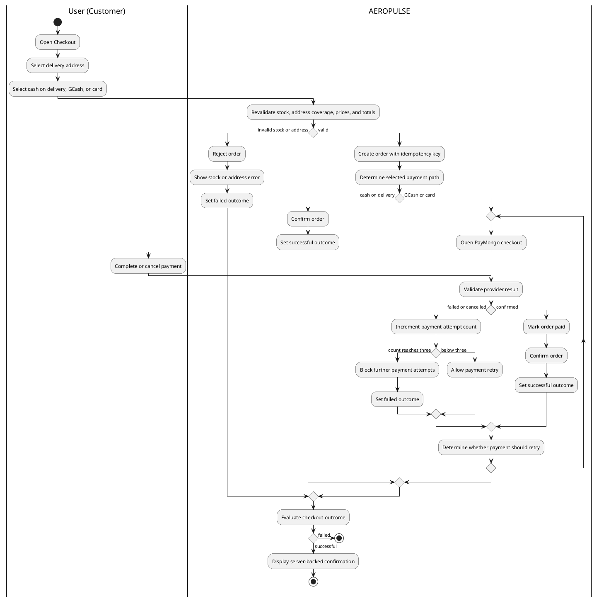
```plantuml
@startuml
|User (Customer)|
start
:Open Checkout;
:Select delivery address;
:Select cash on delivery, GCash, or card;
|AEROPULSE|
:Revalidate stock, address coverage, prices, and totals;
if () then (invalid stock or address)
  :Reject order;
  :Show stock or address error;
  :Set failed outcome;
else (valid)
  :Create order with idempotency key;
  :Determine selected payment path;
  if () then (cash on delivery)
    :Confirm order;
    :Set successful outcome;
  else (GCash or card)
    repeat
      :Open PayMongo checkout;
      |User (Customer)|
      :Complete or cancel payment;
      |AEROPULSE|
      :Validate provider result;
      if () then (failed or cancelled)
        :Increment payment attempt count;
        if () then (count reaches three)
          :Block further payment attempts;
          :Set failed outcome;
        else (below three)
          :Allow payment retry;
        endif
      else (confirmed)
        :Mark order paid;
        :Confirm order;
        :Set successful outcome;
      endif
      :Determine whether payment should retry;
    repeat while ()
  endif
endif
:Evaluate checkout outcome;
if () then (successful)
  :Display server-backed confirmation;
  stop
else (failed)
  stop
endif
@enduml
```

### 7. View orders

Corrected the flow to converge the empty, inaccessible, and successful branches on one reachable exit without adding unsupported mobile pagination.

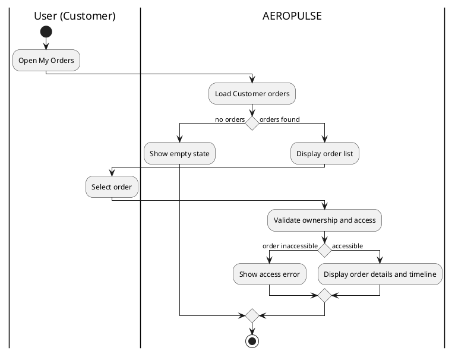
```plantuml
@startuml
|User (Customer)|
start
:Open My Orders;
|AEROPULSE|
:Load Customer orders;
if () then (no orders)
  :Show empty state;
else (orders found)
  :Display order list;
  |User (Customer)|
  :Select order;
  |AEROPULSE|
  :Validate ownership and access;
  if () then (order inaccessible)
    :Show access error;
  else (accessible)
    :Display order details and timeline;
  endif
endif
stop
@enduml
```

### 8. Manage order

Corrected the flow by adding an explicit action-type evaluation before the second decision and converging all order-action outcomes on one exit node.

```plantuml
@startuml
|User (Customer)|
start
:Open order;
:Select Track, Pay Again, Cancel, Reorder, or Receipt;
|AEROPULSE|
:Validate ownership, workflow state, and action eligibility;
if () then (action not allowed)
  :Block action;
  :Show eligibility error;
else (allowed)
  :Determine selected action type;
  if () then (Pay Again)
    repeat
      :Open PayMongo checkout;
      |User (Customer)|
      :Complete or cancel payment;
      |AEROPULSE|
      :Validate provider result;
      if () then (failed or cancelled)
        :Increment payment attempt count;
        if () then (count reaches three)
          :Block payment;
          :Set payment-failed outcome;
        else (below three)
          :Allow payment retry;
        endif
      else (confirmed)
        :Mark order paid;
        :Set payment-confirmed outcome;
      endif
      :Determine whether payment should retry;
    repeat while ()
  else (Track, Cancel, Reorder, or Receipt)
    :Save action or open permitted destination;
  endif
  :Refresh order state;
endif
stop
@enduml
```

### 9. View my units

Corrected the flow to converge the empty, unauthorized, and successful branches on one exit node.

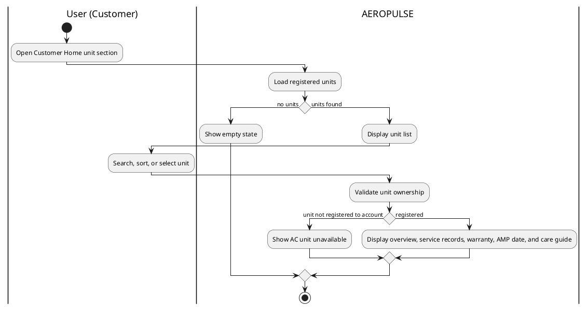
```plantuml
@startuml
|User (Customer)|
start
:Open Customer Home unit section;
|AEROPULSE|
:Load registered units;
if () then (no units)
  :Show empty state;
else (units found)
  :Display unit list;
  |User (Customer)|
  :Search, sort, or select unit;
  |AEROPULSE|
  :Validate unit ownership;
  if () then (unit not registered to account)
    :Show AC unit unavailable;
  else (registered)
    :Display overview, service records, warranty, AMP date, and care guide;
  endif
endif
stop
@enduml
```

### 10. Book service

Corrected the flow to preserve an exact preselected AC unit when opened from Unit Details and show unit selection only when the request starts from general Services.

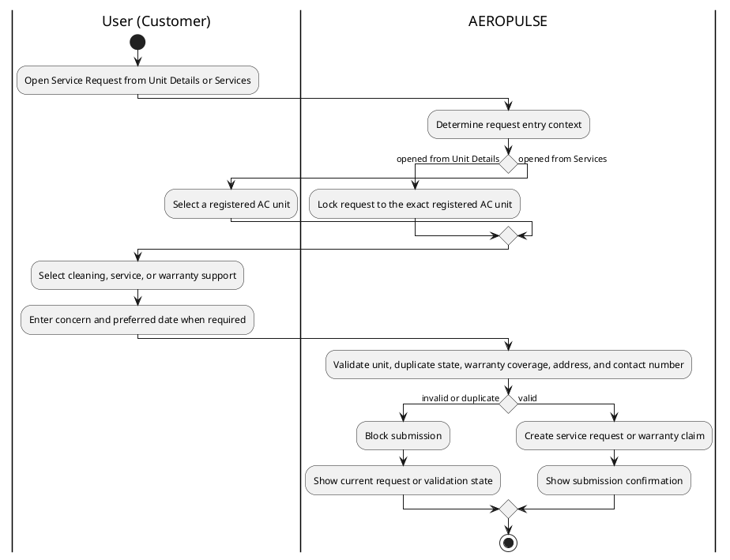
```plantuml
@startuml
|User (Customer)|
start
:Open Service Request from Unit Details or Services;
|AEROPULSE|
:Determine request entry context;
if () then (opened from Unit Details)
  :Lock request to the exact registered AC unit;
else (opened from Services)
  |User (Customer)|
  :Select a registered AC unit;
endif
|User (Customer)|
:Select cleaning, service, or warranty support;
:Enter concern and preferred date when required;
|AEROPULSE|
:Validate unit, duplicate state, warranty coverage, address, and contact number;
if () then (invalid or duplicate)
  :Block submission;
  :Show current request or validation state;
else (valid)
  :Create service request or warranty claim;
  :Show submission confirmation;
endif
stop
@enduml
```

### 11. View work orders

Corrected the flow to retain current recent-first sorting and filtering while converging empty, stale-assignment, and successful paths on one exit node.

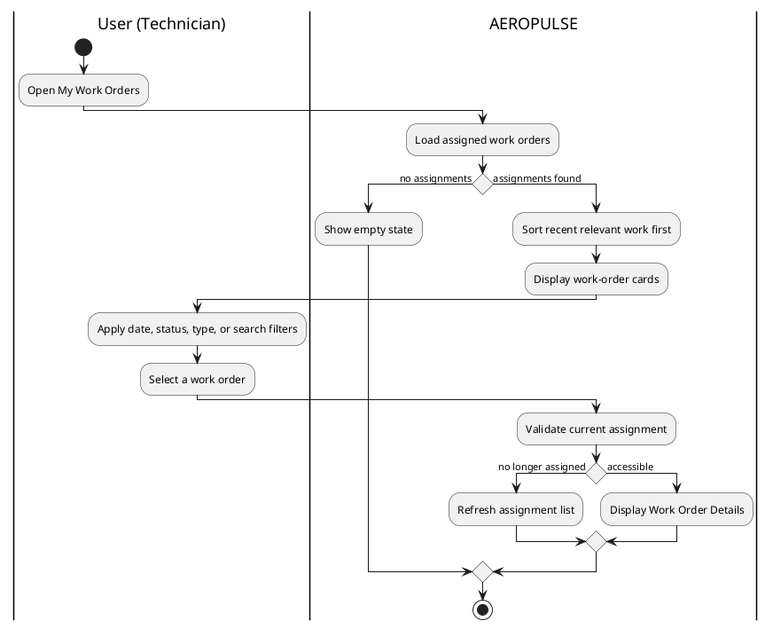
```plantuml
@startuml
|User (Technician)|
start
:Open My Work Orders;
|AEROPULSE|
:Load assigned work orders;
if () then (no assignments)
  :Show empty state;
else (assignments found)
  :Sort recent relevant work first;
  :Display work-order cards;
  |User (Technician)|
  :Apply date, status, type, or search filters;
  :Select a work order;
  |AEROPULSE|
  :Validate current assignment;
  if () then (no longer assigned)
    :Refresh assignment list;
  else (accessible)
    :Display Work Order Details;
  endif
endif
stop
@enduml
```

### 12. Check in

Verified.

### 13. Identify unit

Verified.

### 14. Record visit attempt

Verified.

### 15. Submit work report

Verified.

### 16. Manage notes

Verified.

### 17. View notifications

Corrected the flow to converge empty, inaccessible-destination, and successful branches while retaining server-backed read synchronization and the current absence of mobile archive controls.

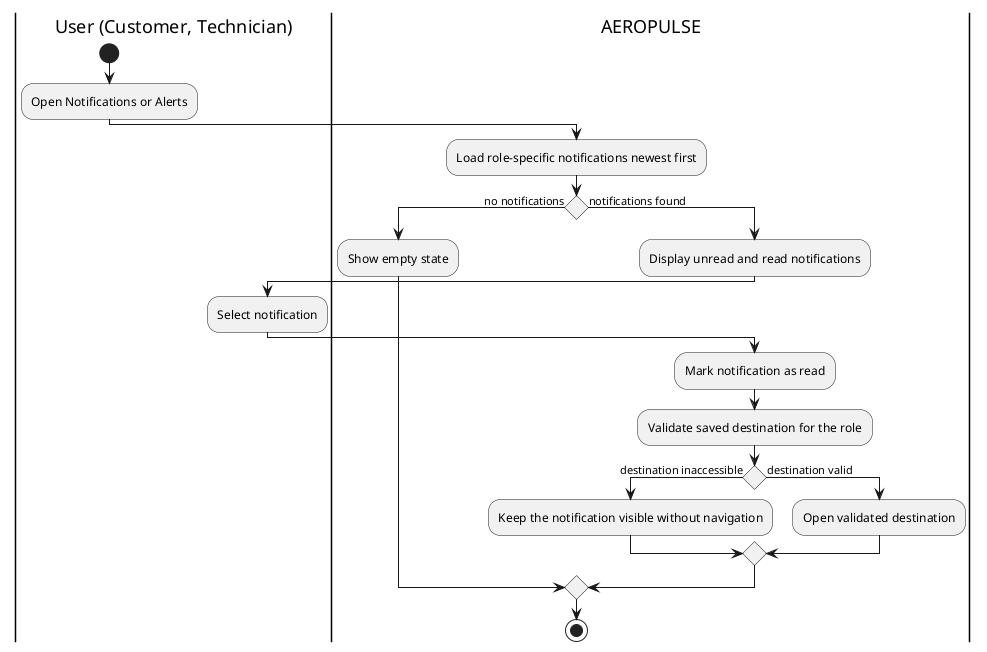
```plantuml
@startuml
|User (Customer, Technician)|
start
:Open Notifications or Alerts;
|AEROPULSE|
:Load role-specific notifications newest first;
if () then (no notifications)
  :Show empty state;
else (notifications found)
  :Display unread and read notifications;
  |User (Customer, Technician)|
  :Select notification;
  |AEROPULSE|
  :Mark notification as read;
  :Validate saved destination for the role;
  if () then (destination inaccessible)
    :Keep the notification visible without navigation;
  else (destination valid)
    :Open validated destination;
  endif
endif
stop
@enduml
```

### 18. Contact support

Verified.

### 19. Manage profile

Verified.

### 20. Manage addresses

Verified.

### 21. Change password

Corrected the flow to expose authenticated password change only to Technician and direct Customer to the implemented password-recovery flow.

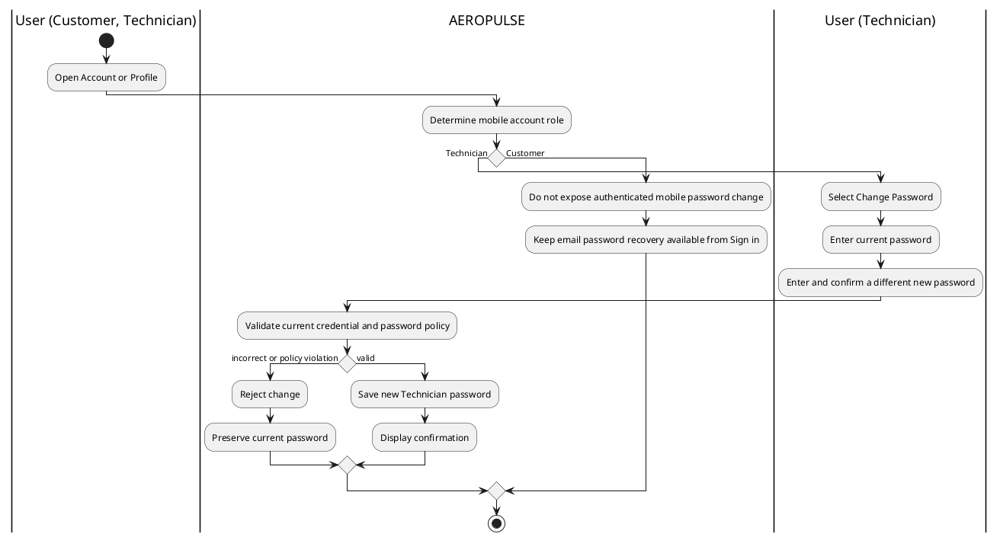
```plantuml
@startuml
|User (Customer, Technician)|
start
:Open Account or Profile;
|AEROPULSE|
:Determine mobile account role;
if () then (Technician)
  |User (Technician)|
  :Select Change Password;
  :Enter current password;
  :Enter and confirm a different new password;
  |AEROPULSE|
  :Validate current credential and password policy;
  if () then (incorrect or policy violation)
    :Reject change;
    :Preserve current password;
  else (valid)
    :Save new Technician password;
    :Display confirmation;
  endif
else (Customer)
  :Do not expose authenticated mobile password change;
  :Keep email password recovery available from Sign in;
endif
stop
@enduml
```

### 22. Change authenticator

Corrected the flow to show that authenticated authenticator replacement is unavailable, Customer setup and recovery remain separate flows, and Technician authenticator use is blocked.

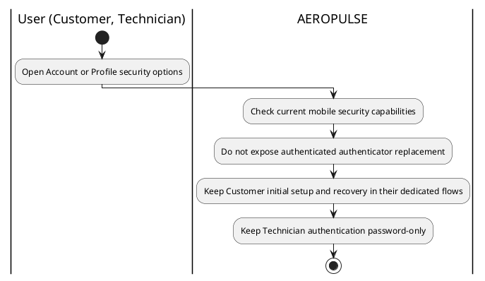
```plantuml
@startuml
|User (Customer, Technician)|
start
:Open Account or Profile security options;
|AEROPULSE|
:Check current mobile security capabilities;
:Do not expose authenticated authenticator replacement;
:Keep Customer initial setup and recovery in their dedicated flows;
:Keep Technician authentication password-only;
stop
@enduml
```

## Web Application

### 1. Sign in

Corrected the flow to treat Visitor as the signed-out initiator, request TOTP only when enabled for the account, and consolidate authentication outcomes into two exits.

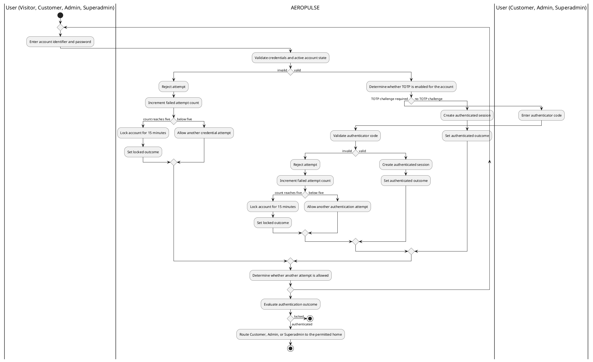
```plantuml
@startuml
|User (Visitor, Customer, Admin, Superadmin)|
start
repeat
  :Enter account identifier and password;
  |AEROPULSE|
  :Validate credentials and active account state;
  if () then (invalid)
    :Reject attempt;
    :Increment failed attempt count;
    if () then (count reaches five)
      :Lock account for 15 minutes;
      :Set locked outcome;
    else (below five)
      :Allow another credential attempt;
    endif
  else (valid)
    :Determine whether TOTP is enabled for the account;
    if () then (TOTP challenge required)
      |User (Customer, Admin, Superadmin)|
      :Enter authenticator code;
      |AEROPULSE|
      :Validate authenticator code;
      if () then (invalid)
        :Reject attempt;
        :Increment failed attempt count;
        if () then (count reaches five)
          :Lock account for 15 minutes;
          :Set locked outcome;
        else (below five)
          :Allow another authentication attempt;
        endif
      else (valid)
        :Create authenticated session;
        :Set authenticated outcome;
      endif
    else (no TOTP challenge)
      :Create authenticated session;
      :Set authenticated outcome;
    endif
  endif
  :Determine whether another attempt is allowed;
repeat while ()
:Evaluate authentication outcome;
if () then (authenticated)
  :Route Customer, Admin, or Superadmin to the permitted home;
  stop
else (locked)
  stop
endif
@enduml
```

### 2. Register

Corrected the flow to keep the new Customer authenticated and route directly to the mounted authenticator-setup page instead of returning the account to Sign in.

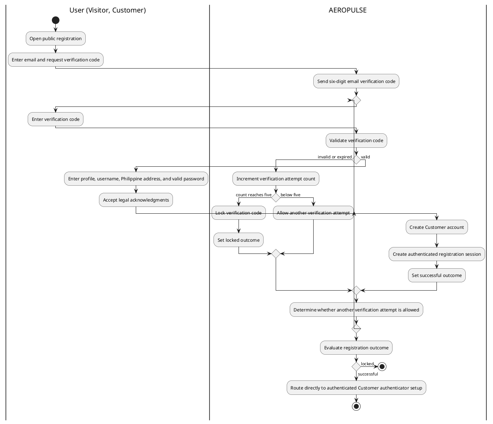
```plantuml
@startuml
|User (Visitor, Customer)|
start
:Open public registration;
:Enter email and request verification code;
|AEROPULSE|
:Send six-digit email verification code;
repeat
  |User (Visitor, Customer)|
  :Enter verification code;
  |AEROPULSE|
  :Validate verification code;
  if () then (invalid or expired)
    :Increment verification attempt count;
    if () then (count reaches five)
      :Lock verification code;
      :Set locked outcome;
    else (below five)
      :Allow another verification attempt;
    endif
  else (valid)
    |User (Visitor, Customer)|
    :Enter profile, username, Philippine address, and valid password;
    :Accept legal acknowledgments;
    |AEROPULSE|
    :Create Customer account;
    :Create authenticated registration session;
    :Set successful outcome;
  endif
  :Determine whether another verification attempt is allowed;
repeat while ()
:Evaluate registration outcome;
if () then (successful)
  :Route directly to authenticated Customer authenticator setup;
  stop
else (locked)
  stop
endif
@enduml
```

### 3. Recover account

Corrected the flow to represent the mounted web password-reset process only, because authenticator recovery and replacement are not exposed on the web application.

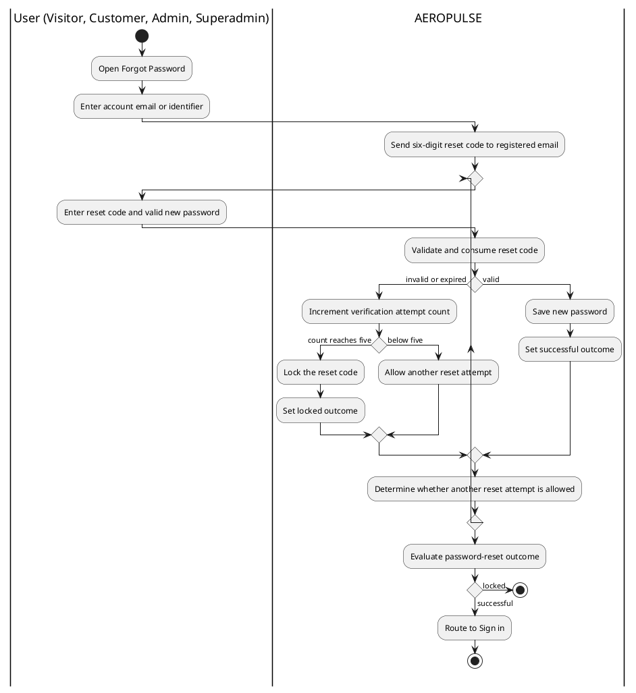
```plantuml
@startuml
|User (Visitor, Customer, Admin, Superadmin)|
start
:Open Forgot Password;
:Enter account email or identifier;
|AEROPULSE|
:Send six-digit reset code to registered email;
repeat
  |User (Visitor, Customer, Admin, Superadmin)|
  :Enter reset code and valid new password;
  |AEROPULSE|
  :Validate and consume reset code;
  if () then (invalid or expired)
    :Increment verification attempt count;
    if () then (count reaches five)
      :Lock the reset code;
      :Set locked outcome;
    else (below five)
      :Allow another reset attempt;
    endif
  else (valid)
    :Save new password;
    :Set successful outcome;
  endif
  :Determine whether another reset attempt is allowed;
repeat while ()
:Evaluate password-reset outcome;
if () then (successful)
  :Route to Sign in;
  stop
else (locked)
  stop
endif
@enduml
```

### 4. Browse catalogue

Verified.

### 5. Manage cart

Verified.

### 6. Checkout

Corrected the flow to represent cash on delivery, GCash, and card while consolidating validation, payment-block, and success outcomes into two exit nodes.

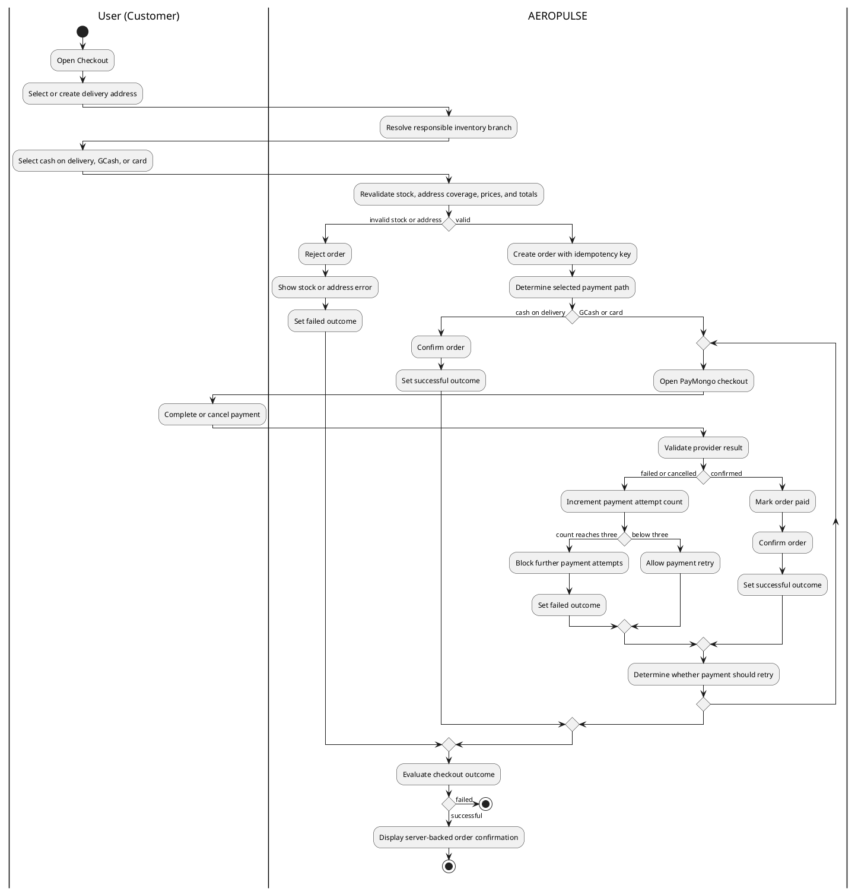
```plantuml
@startuml
|User (Customer)|
start
:Open Checkout;
:Select or create delivery address;
|AEROPULSE|
:Resolve responsible inventory branch;
|User (Customer)|
:Select cash on delivery, GCash, or card;
|AEROPULSE|
:Revalidate stock, address coverage, prices, and totals;
if () then (invalid stock or address)
  :Reject order;
  :Show stock or address error;
  :Set failed outcome;
else (valid)
  :Create order with idempotency key;
  :Determine selected payment path;
  if () then (cash on delivery)
    :Confirm order;
    :Set successful outcome;
  else (GCash or card)
    repeat
      :Open PayMongo checkout;
      |User (Customer)|
      :Complete or cancel payment;
      |AEROPULSE|
      :Validate provider result;
      if () then (failed or cancelled)
        :Increment payment attempt count;
        if () then (count reaches three)
          :Block further payment attempts;
          :Set failed outcome;
        else (below three)
          :Allow payment retry;
        endif
      else (confirmed)
        :Mark order paid;
        :Confirm order;
        :Set successful outcome;
      endif
      :Determine whether payment should retry;
    repeat while ()
  endif
endif
:Evaluate checkout outcome;
if () then (successful)
  :Display server-backed order confirmation;
  stop
else (failed)
  stop
endif
@enduml
```

### 7. Manage listings

Verified.

### 8. View stock

Verified.

### 9. Request restock

Verified.

### 10. Approve restock

Verified.

### 11. Manage unit registry

Corrected the flow to preserve Admin view-only access and Superadmin serial updates while converging all branches on one exit node.

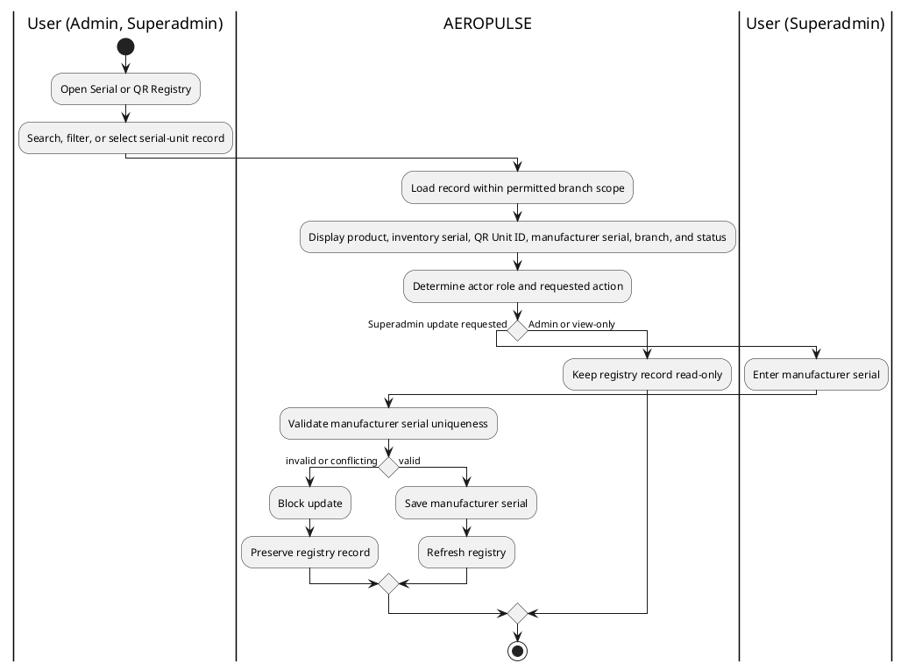
```plantuml
@startuml
|User (Admin, Superadmin)|
start
:Open Serial or QR Registry;
:Search, filter, or select serial-unit record;
|AEROPULSE|
:Load record within permitted branch scope;
:Display product, inventory serial, QR Unit ID, manufacturer serial, branch, and status;
:Determine actor role and requested action;
if () then (Superadmin update requested)
  |User (Superadmin)|
  :Enter manufacturer serial;
  |AEROPULSE|
  :Validate manufacturer serial uniqueness;
  if () then (invalid or conflicting)
    :Block update;
    :Preserve registry record;
  else (valid)
    :Save manufacturer serial;
    :Refresh registry;
  endif
else (Admin or view-only)
  :Keep registry record read-only;
endif
stop
@enduml
```

### 12. View orders

Corrected the flow to converge empty, inaccessible, and successful Customer-order paths on one exit node.

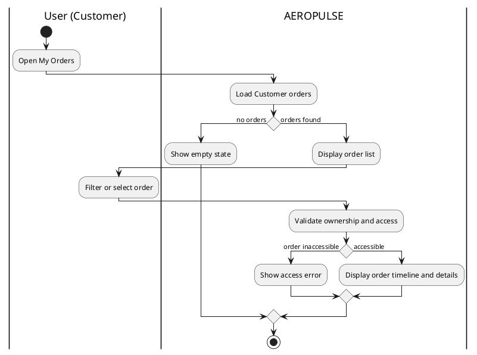
```plantuml
@startuml
|User (Customer)|
start
:Open My Orders;
|AEROPULSE|
:Load Customer orders;
if () then (no orders)
  :Show empty state;
else (orders found)
  :Display order list;
  |User (Customer)|
  :Filter or select order;
  |AEROPULSE|
  :Validate ownership and access;
  if () then (order inaccessible)
    :Show access error;
  else (accessible)
    :Display order timeline and details;
  endif
endif
stop
@enduml
```

### 13. Manage order

Corrected the flow by adding an explicit action-type evaluation and converging all order-action outcomes on one exit node.

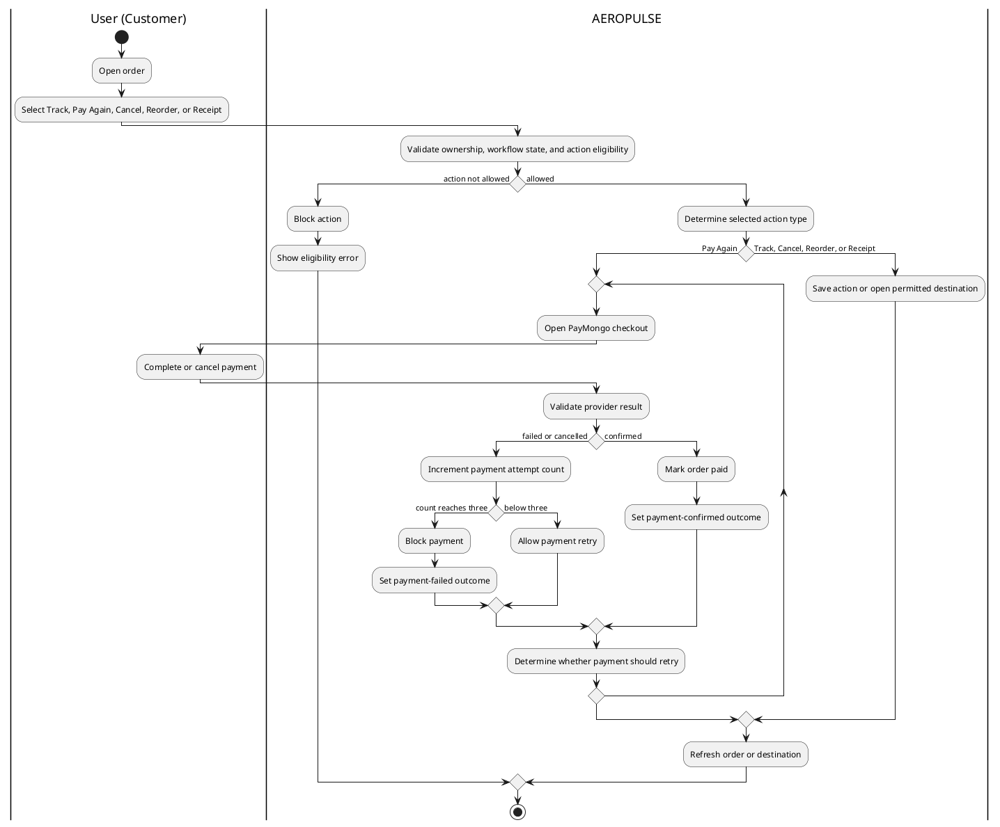
```plantuml
@startuml
|User (Customer)|
start
:Open order;
:Select Track, Pay Again, Cancel, Reorder, or Receipt;
|AEROPULSE|
:Validate ownership, workflow state, and action eligibility;
if () then (action not allowed)
  :Block action;
  :Show eligibility error;
else (allowed)
  :Determine selected action type;
  if () then (Pay Again)
    repeat
      :Open PayMongo checkout;
      |User (Customer)|
      :Complete or cancel payment;
      |AEROPULSE|
      :Validate provider result;
      if () then (failed or cancelled)
        :Increment payment attempt count;
        if () then (count reaches three)
          :Block payment;
          :Set payment-failed outcome;
        else (below three)
          :Allow payment retry;
        endif
      else (confirmed)
        :Mark order paid;
        :Set payment-confirmed outcome;
      endif
      :Determine whether payment should retry;
    repeat while ()
  else (Track, Cancel, Reorder, or Receipt)
    :Save action or open permitted destination;
  endif
  :Refresh order or destination;
endif
stop
@enduml
```

### 14. View customer orders

Corrected the flow to retain scoped filtering and pagination while converging empty, stale-record, and successful paths on one exit node.

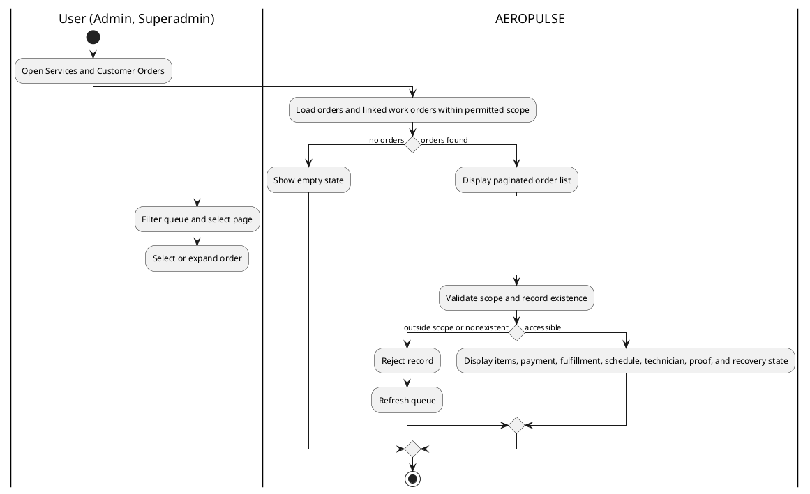
```plantuml
@startuml
|User (Admin, Superadmin)|
start
:Open Services and Customer Orders;
|AEROPULSE|
:Load orders and linked work orders within permitted scope;
if () then (no orders)
  :Show empty state;
else (orders found)
  :Display paginated order list;
  |User (Admin, Superadmin)|
  :Filter queue and select page;
  :Select or expand order;
  |AEROPULSE|
  :Validate scope and record existence;
  if () then (outside scope or nonexistent)
    :Reject record;
    :Refresh queue;
  else (accessible)
    :Display items, payment, fulfillment, schedule, technician, proof, and recovery state;
  endif
endif
stop
@enduml
```

### 15. Manage customer order

Verified.

### 16. View my units

Corrected the flow to converge empty, unauthorized, and successful unit paths on one exit node.

```plantuml
@startuml
|User (Customer)|
start
:Open My AC Units;
|AEROPULSE|
:Load units registered to Customer;
if () then (no units)
  :Show empty state;
else (units found)
  :Display unit list;
  |User (Customer)|
  :Search, filter, sort, or select unit;
  |AEROPULSE|
  :Validate unit ownership;
  if () then (unit not registered)
    :Show availability error;
  else (registered)
    :Open unit-details modal;
    :Display overview, history, warranty, AMP date, explanation, and care guide;
  endif
endif
stop
@enduml
```

### 17. Manage service requests

Corrected the flow to include the current cancellation action alongside quote and assignment processing and to synchronize the linked request and work-order state after each valid mutation.

```plantuml
@startuml
|User (Admin, Superadmin)|
start
:Open Services and Service Requests;
:Search or filter request queue;
:Select request;
:Choose Set Quote, Assign Technician, or Cancel Request;
|AEROPULSE|
:Validate current request status and selected action;
if () then (cancel request)
  :Evaluate cancellation eligibility for the current request state;
  if () then (cancellation not allowed)
    :Block cancellation;
    :Show current request state;
  else (allowed)
    :Cancel service request without deleting history;
    :Synchronize linked work order and notifications;
  endif
else (quote or assignment)
  |User (Admin, Superadmin)|
  :Enter quote or select technician, date, and time slot;
  |AEROPULSE|
  :Validate quote, technician eligibility, schedule, and Service Quota;
  if () then (invalid, conflict, or ineligible)
    :Block mutation;
    :Show validation or scheduling error;
  else (valid)
    :Save quote or assignment;
    :Create or update linked work order;
    :Notify Customer and Technician when assigned;
  endif
endif
:Refresh synchronized request and work-order state;
stop
@enduml
```

### 18. Manage technicians

Verified.

### 19. View schedule

Verified.

### 20. Handle messages

Verified.

### 21. View maintenance

Corrected the flow to include current pagination and See more expansion while converging empty, out-of-scope, and successful recommendation paths on one exit node.

```plantuml
@startuml
|User (Admin, Superadmin)|
start
:Open AMP Planning;
|AEROPULSE|
:Load paginated maintenance units and recommendations for permitted scope;
if () then (no units in scope)
  :Show empty state;
else (units found)
  :Display recommendation list and pagination controls;
  |User (Admin, Superadmin)|
  :Filter list or select page;
  :Select Review recommendation;
  |AEROPULSE|
  :Validate branch scope;
  if () then (unit outside scope)
    :Block record;
    :Show access error;
  else (in scope)
    :Display compact recommendation sections;
    |User (Admin, Superadmin)|
    :Select See more when full details are required;
    |AEROPULSE|
    :Expand assessment, technician record, issues, completed work, observations, priority, actions, schedule, explanation, and context;
    :Open or save the permitted service-plan review;
  endif
endif
stop
@enduml
```

### 22. View workload plan

Verified.

### 23. Generate reports

Verified.

### 24. View dashboard

Verified.

### 25. Manage branches

Verified.

### 26. View notifications

Corrected the flow to limit archive and restore controls to Admin and Superadmin, keep Customer notifications read-and-open only, and converge all branches on one exit node.

```plantuml
@startuml
|User (Customer, Admin, Superadmin)|
start
:Open notification control;
|AEROPULSE|
:Load notifications for authenticated account;
if () then (no notifications)
  :Show empty state;
else (notifications found)
  :Display unread and read notifications;
  |User (Customer, Admin, Superadmin)|
  :Select notification or available folder action;
  |AEROPULSE|
  :Determine actor role and selected action;
  if () then (Admin or Superadmin archive or restore)
    :Update notification archive state;
    :Refresh active or archived folder;
  else (open notification)
    :Mark notification as read;
    :Validate saved destination for the role;
    if () then (destination invalid)
      :Keep notification visible without navigation;
    else (valid)
      :Open validated destination;
    endif
  endif
endif
stop
@enduml
```

### 27. Contact support

Verified.

### 28. Manage profile

Verified.

### 29. Manage addresses

Verified.

### 30. Change password

Verified.

### 31. Change authenticator

Corrected the flow to show that authenticated web authenticator replacement is not mounted and that only Customer initial setup is available as a separate route.

```plantuml
@startuml
|User (Customer, Admin, Superadmin)|
start
:Open authenticated Security or Profile options;
|AEROPULSE|
:Check current web security capabilities;
:Do not expose authenticated authenticator replacement;
:Keep Customer initial authenticator setup on its dedicated route;
:Keep web password reset available through Forgot Password;
stop
@enduml
```
